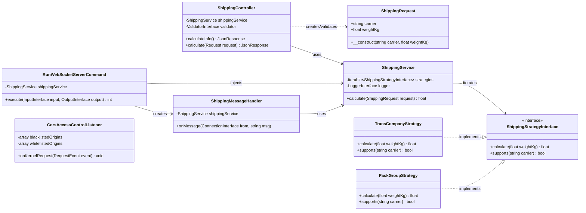
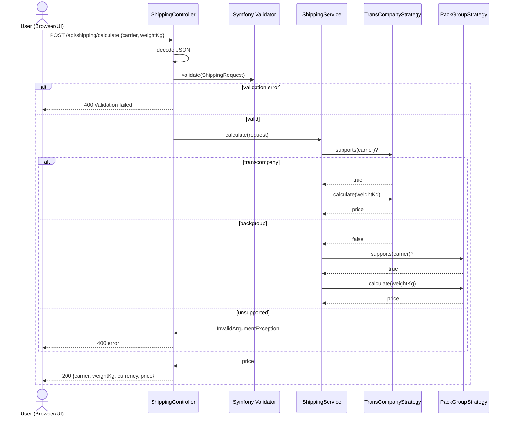
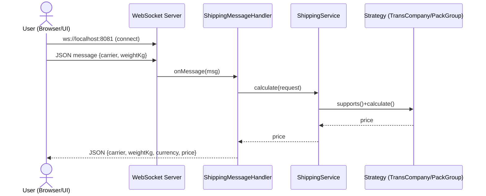

# C4 Level 4 (Code) — Shipping Cost Calculator

> Этот документ расширяет C4-модель проекта до **уровня 4 (Code)**.
> Уровни 1–3 см. в `docs/c4-model.md`.

---

## RU — Уровень 4 (Code)

### 1) Backend: ключевые классы и зависимости

### 2) REST-поток (POST /api/shipping/calculate)

### 3) WebSocket-поток

### 4) Соответствие слоям Clean Architecture

- **Domain**
  - `ShippingStrategyInterface`
  - `Model/ShippingRequest`

- **Application**
  - `ShippingService` (оркестрация стратегий + логирование)

- **Infrastructure**
  - REST: `ShippingController`, `ApiDocController`
  - WS: `RunWebSocketServerCommand`, `ShippingMessageHandler`
  - Integrations: `CorsAccessControlListener`, concrete strategies

### 5) Расширение новым перевозчиком (на уровне кода)

1. Добавить класс стратегии, реализующий `ShippingStrategyInterface`.
2. Пометить стратегию тегом `app.shipping_strategy` в `backend/config/services.yaml`.
3. (Опционально) добавить тест-кейсы в `E2E/tests/shipping.spec.ts`.

---

## EN — Level 4 (Code)

### 1) Backend classes and dependencies

At code level, the core flow is:

- `ShippingController` receives HTTP requests and validates input.
- `ShippingService` selects a strategy from tagged services.
- Concrete strategies (`TransCompanyStrategy`, `PackGroupStrategy`) perform price calculation.
- `ShippingMessageHandler` reuses the same `ShippingService` for WebSocket requests.

### 2) REST flow

`POST /api/shipping/calculate` → Controller → Validation → Service → Strategy selection → JSON response.

### 3) WebSocket flow

WebSocket message (`carrier`, `weightKg`) → `ShippingMessageHandler` → `ShippingService` → strategy → JSON response.

### 4) Clean Architecture mapping

- **Domain**: interface + request model
- **Application**: orchestration service
- **Infrastructure**: controllers, websocket runtime, listeners, concrete adapters

### 5) How to add a new carrier

Implement `ShippingStrategyInterface`, register it with tag `app.shipping_strategy`, and add tests.
