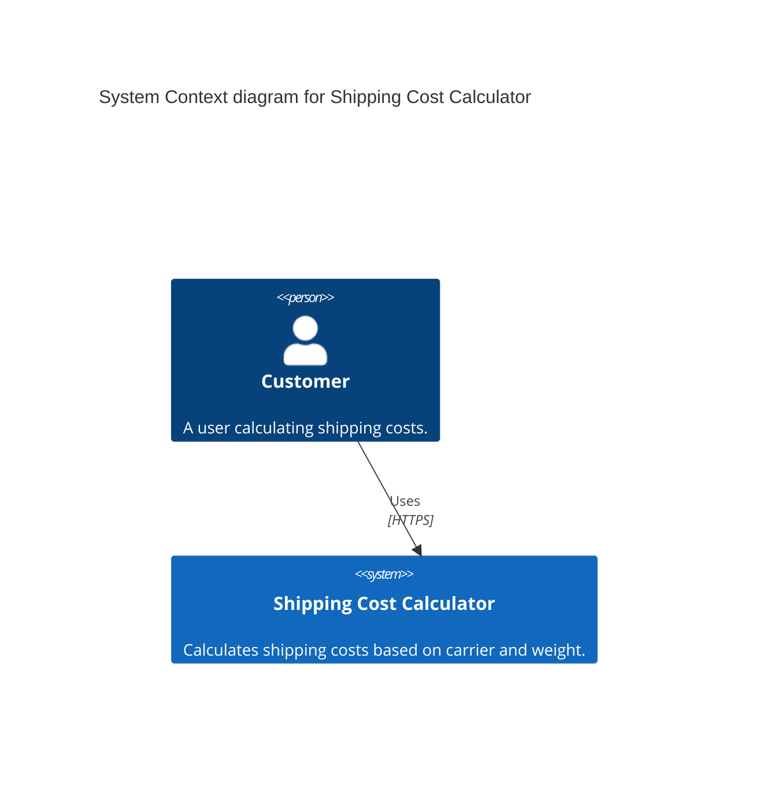
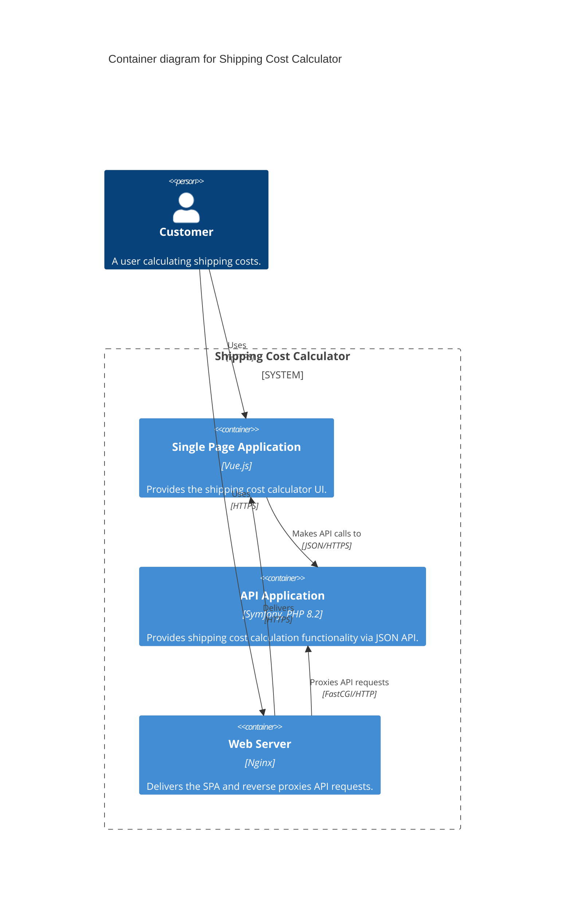
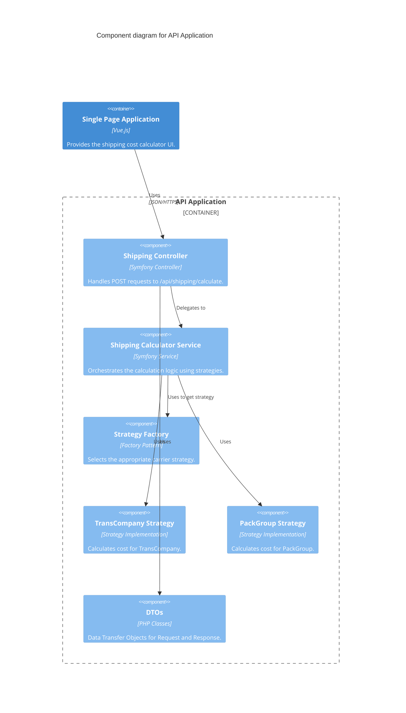
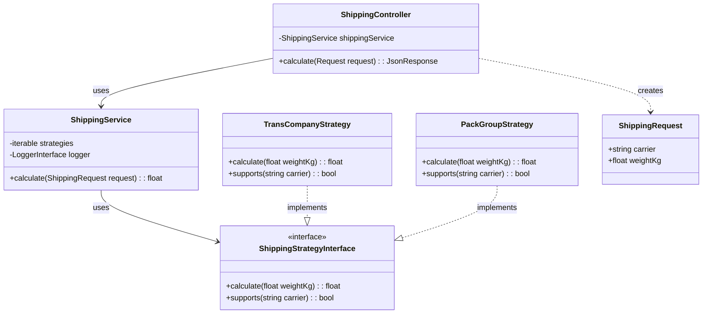

# C4 Model - Shipping Cost Calculator

## 1. Context Diagram

```mermaid
C4Context
    title System Context diagram for Shipping Cost Calculator

    Person(customer, "Customer", "A user calculating shipping costs.")
    System(shipping_system, "Shipping Cost Calculator", "Calculates shipping costs based on carrier and weight.")

    Rel(customer, shipping_system, "Uses", "HTTPS")
```

## 2. Container Diagram

```mermaid
C4Container
    title Container diagram for Shipping Cost Calculator

    Person(customer, "Customer", "A user calculating shipping costs.")

    System_Boundary(shipping_system_boundary, "Shipping Cost Calculator") {
        Container(web_app, "Single Page Application", "Vue.js", "Provides the shipping cost calculator UI.")
        Container(api_app, "API Application", "Symfony, PHP 8.2", "Provides shipping cost calculation functionality via JSON API.")
        Container(web_server, "Web Server", "Nginx", "Delivers the SPA and reverse proxies API requests.")
    }

    Rel(customer, web_app, "Uses", "HTTPS")
    Rel(customer, web_server, "Uses", "HTTPS")
    Rel(web_server, web_app, "Delivers", "HTTPS")
    Rel(web_server, api_app, "Proxies API requests", "FastCGI/HTTP")
    Rel(web_app, api_app, "Makes API calls to", "JSON/HTTPS")
```

## 3. Component Diagram (API Application)

```mermaid
C4Component
    title Component diagram for API Application

    Container(web_app, "Single Page Application", "Vue.js", "Provides the shipping cost calculator UI.")

    Container_Boundary(api_app, "API Application") {
        Component(shipping_controller, "Shipping Controller", "Symfony Controller", "Handles POST requests to /api/shipping/calculate.")
        Component(shipping_service, "Shipping Calculator Service", "Symfony Service", "Orchestrates the calculation logic using strategies.")
        Component(carrier_strategy_factory, "Strategy Factory", "Factory Pattern", "Selects the appropriate carrier strategy.")
        Component(transcompany_strategy, "TransCompany Strategy", "Strategy Implementation", "Calculates cost for TransCompany.")
        Component(packgroup_strategy, "PackGroup Strategy", "Strategy Implementation", "Calculates cost for PackGroup.")
        Component(dto, "DTOs", "PHP Classes", "Data Transfer Objects for Request and Response.")
    }

    Rel(web_app, shipping_controller, "Uses", "JSON/HTTPS")
    Rel(shipping_controller, shipping_service, "Delegates to")
    Rel(shipping_service, carrier_strategy_factory, "Uses to get strategy")
    Rel(shipping_service, transcompany_strategy, "Uses")
    Rel(shipping_service, packgroup_strategy, "Uses")
    Rel(shipping_controller, dto, "Uses")
```

## 4. Code Level (Class Diagram)

```mermaid
classDiagram
    class ShippingController {
        -ShippingService shippingService
        +calculate(Request request): JsonResponse
    }

    class ShippingService {
        -iterable strategies
        -LoggerInterface logger
        +calculate(ShippingRequest request): float
    }

    class ShippingStrategyInterface {
        <<interface>>
        +calculate(float weightKg): float
        +supports(string carrier): bool
    }

    class TransCompanyStrategy {
        +calculate(float weightKg): float
        +supports(string carrier): bool
    }

    class PackGroupStrategy {
        +calculate(float weightKg): float
        +supports(string carrier): bool
    }

    class ShippingRequest {
        +string carrier
        +float weightKg
    }

    ShippingController --> ShippingService : uses
    ShippingController ..> ShippingRequest : creates
    ShippingService --> ShippingStrategyInterface : uses
    TransCompanyStrategy ..|> ShippingStrategyInterface : implements
    PackGroupStrategy ..|> ShippingStrategyInterface : implements
```
