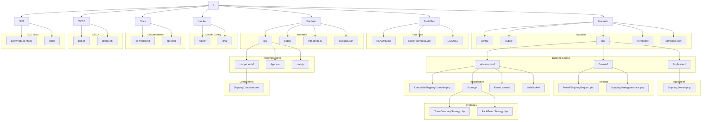

# Project File Structure Graph

This graph visualizes the file structure of the Shipping Cost Calculator project.

```mermaid
graph TD
    Root["/"] --> Backend["/backend"]
    Root --> Frontend["/frontend"]
    Root --> Docker["/docker"]
    Root --> Docs["/docs"]
    Root --> CICD["/CI/CD"]
    Root --> E2E["/E2E"]
    Root --> RootFiles["Root Files"]

    subgraph RootFiles_ [Root Files]
        direction TB
        README["README.md"]
        Compose["docker-compose.yml"]
        License["LICENSE"]
    end
    RootFiles --> README
    RootFiles --> Compose
    RootFiles --> License

    subgraph Backend_ [Backend]
        direction TB
        B_Config["config/"]
        B_Public["public/"]
        B_Src["src/"]
        B_Kernel["Kernel.php"]
        B_Composer["composer.json"]
    end
    Backend --> B_Config
    Backend --> B_Public
    Backend --> B_Src
    Backend --> B_Kernel
    Backend --> B_Composer

    subgraph Backend_Src_ [Backend Source]
        direction TB
        B_App["Application/"]
        B_Dom["Domain/"]
        B_Infra["Infrastructure/"]
    end
    B_Src --> B_App
    B_Src --> B_Dom
    B_Src --> B_Infra

    subgraph Backend_App_ [Application]
        direction TB
        ShippingService["ShippingService.php"]
    end
    B_App --> ShippingService

    subgraph Backend_Dom_ [Domain]
        direction TB
        ShippingRequest["Model/ShippingRequest.php"]
        ShippingStrategyInterface["ShippingStrategyInterface.php"]
    end
    B_Dom --> ShippingRequest
    B_Dom --> ShippingStrategyInterface

    subgraph Backend_Infra_ [Infrastructure]
        direction TB
        ShippingController["Controller/ShippingController.php"]
        Strategies["Strategy/"]
        EventListener["EventListener/"]
        WebSocket["WebSocket/"]
    end
    B_Infra --> ShippingController
    B_Infra --> Strategies
    B_Infra --> EventListener
    B_Infra --> WebSocket

    subgraph Backend_Strategies_ [Strategies]
        direction TB
        TransStrategy["TransCompanyStrategy.php"]
        PackStrategy["PackGroupStrategy.php"]
    end
    Strategies --> TransStrategy
    Strategies --> PackStrategy

    subgraph Frontend_ [Frontend]
        direction TB
        F_Src["src/"]
        F_Public["public/"]
        F_Config["vite.config.js"]
        F_Package["package.json"]
    end
    Frontend --> F_Src
    Frontend --> F_Public
    Frontend --> F_Config
    Frontend --> F_Package

    subgraph Frontend_Src_ [Frontend Source]
        direction TB
        F_Components["components/"]
        F_App["App.vue"]
        F_Main["main.js"]
    end
    F_Src --> F_Components
    F_Src --> F_App
    F_Src --> F_Main

    subgraph Frontend_Components_ [Components]
        direction TB
        CalcComponent["ShippingCalculator.vue"]
    end
    F_Components --> CalcComponent

    subgraph Docker_ [Docker Config]
        direction TB
        D_Nginx["nginx/"]
        D_PHP["php/"]
    end
    Docker --> D_Nginx
    Docker --> D_PHP

    subgraph Docs_ [Documentation]
        direction TB
        Doc_C4["c4-model.md"]
        Doc_API["api.yaml"]
    end
    Docs --> Doc_C4
    Docs --> Doc_API

    subgraph CICD_ [CI/CD]
        direction TB
        TestScript["test.sh"]
        DeployScript["deploy.sh"]
    end
    CICD --> TestScript
    CICD --> DeployScript

    subgraph E2E_ [E2E Tests]
        direction TB
        PlaywrightConfig["playwright.config.js"]
        Tests["tests/"]
    end
    E2E --> PlaywrightConfig
    E2E --> Tests
```
